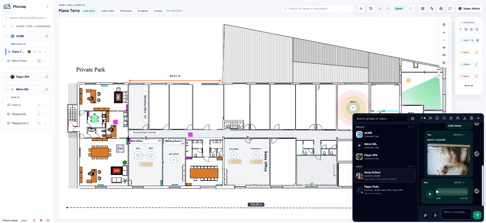
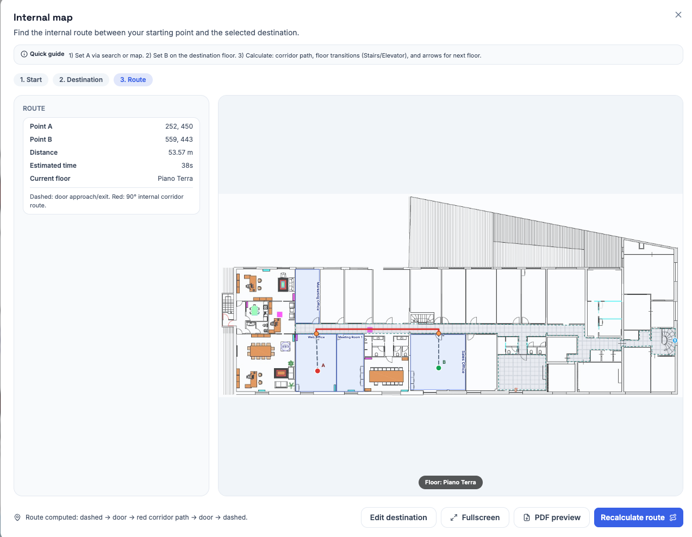
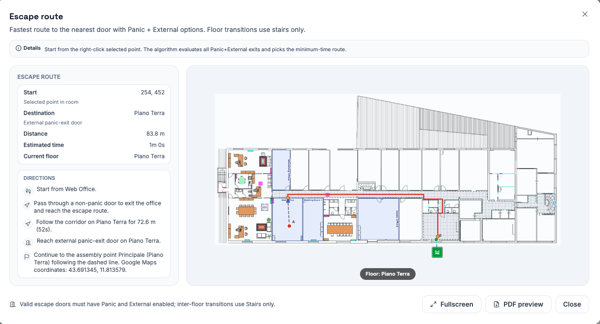
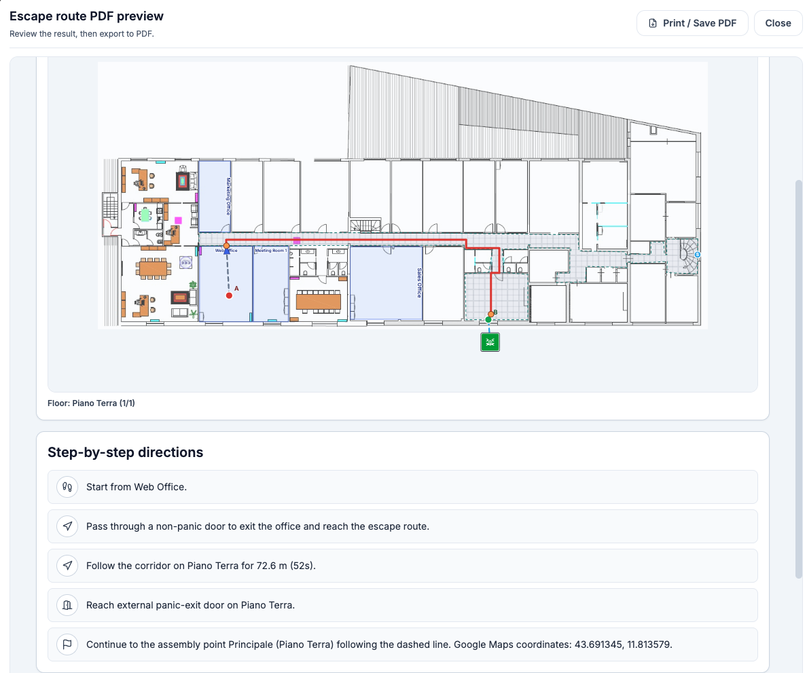
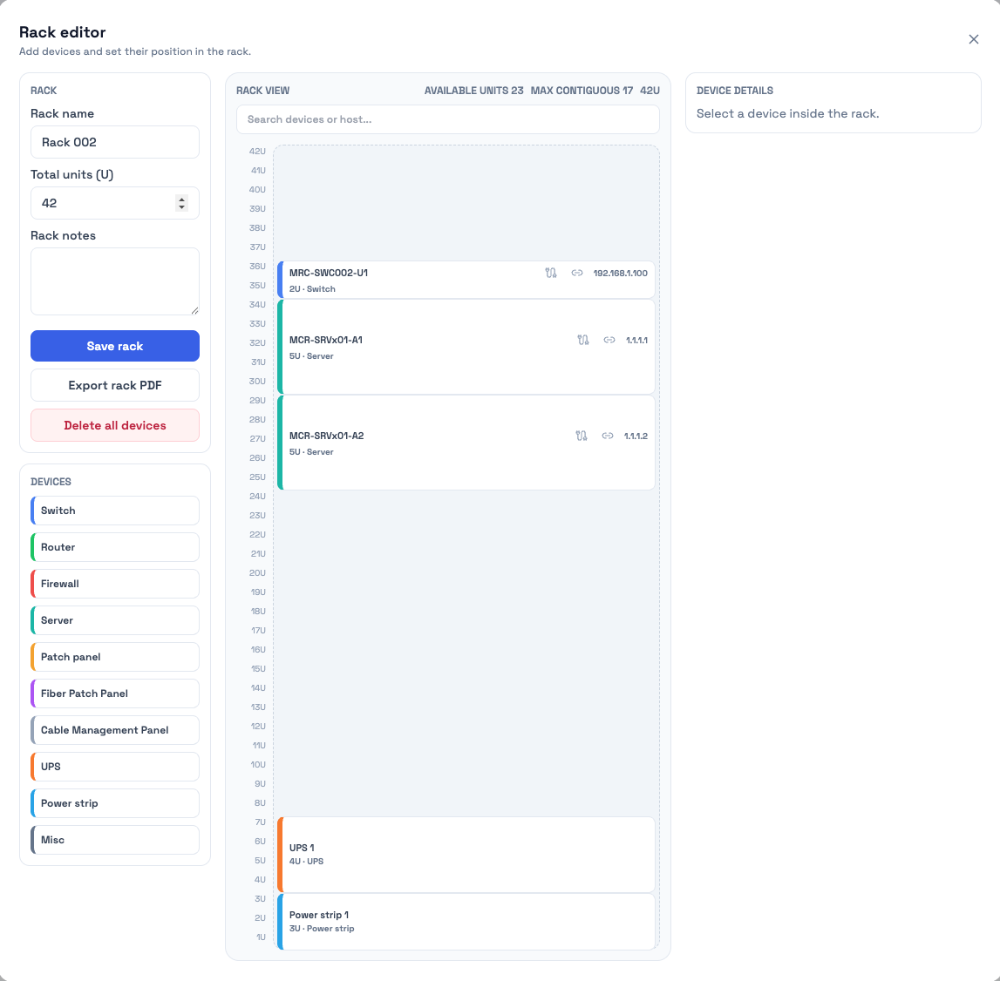
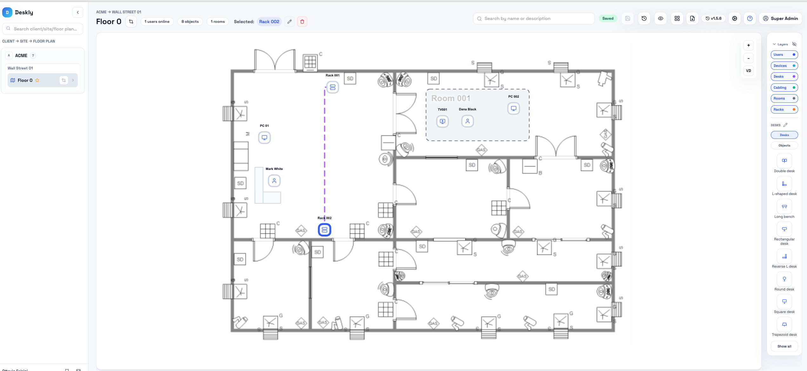

# Plixmap - Floor Plan Management

Current version: 3.0.3

Plixmap is a web app to plan offices and infrastructure on floor plans using a fixed hierarchy **Client -> Site -> Floor plan**. It combines drag & drop editing, rooms, layers, walls, racks, measurements, and PDF exports in one workspace.

## Project links
- Official website: [www.plixmap.com](https://www.plixmap.com)
- GitHub repository: [falott82/Plixmap](https://github.com/falott82/Plixmap)
- Issue tracker: [GitHub Issues](https://github.com/falott82/Plixmap/issues)

## Release notes
- Full release notes: [`CHANGELOG.md`](CHANGELOG.md)
- GitHub view: [`CHANGELOG.md` on GitHub](https://github.com/falott82/Plixmap/blob/main/CHANGELOG.md)

## Highlights
- Floor plan management starting from custom floor plan uploads, with a structured and centralized way to handle multiple clients, sites, and floor plans.
- Corporate asset/device management (PCs, telephony, users, workstations), including custom objects with user-configurable custom fields and advanced control via layers.
- PDF export and printing, with customizable print areas.
- Roles and permissions management for granular control of access and features.
- Creation and management of virtual offices and rooms.
- Wi‑Fi coverage and CCTV planning, with wall drawing and automatic signal attenuation calculations.
- Centralized client notes and documentation, easy to browse and consult.
- Internal messaging system with a dedicated interface.
- Real-user import via Web API and a centralized corporate directory and CSV files.
- Rack configurator and structured cabling management.
- Corridor doors with room linking: right-click a door to link one or more rooms, with nearest-room preselection and door hover info for linked rooms.
- Internal map routing wizard: find a destination (users/devices/racks/rooms), set a start point, and compute a red orthogonal route through corridors and linked doors, with distance and ETA when scale is configured.
- Scaled measurements and dimensions directly on the floor plan.
- Fast object insertion and management via modern drag & drop, copy/paste, duplication, and extensive keyboard shortcuts.

## Safety and emergency
- Dedicated `Safety` layer with prevention/emergency object palette (extinguishers, AED, alarm points, sirens, hydrants, detectors, sprinklers, valves, first aid, etc.).
- Safety object modal with required name, description, notes, last check, verifier company, GPS coordinates.
- Safety documents and checks history in dedicated modals.
- Emergency contacts directory with scopes: `Global`, `Client`, `Site`, `Plan`.
- Emergency contacts support quick search, inline editing, sorting, and “Show in plan card” visibility flag.
- Safety settings panel includes catalogs for devices and emergency doors, with search/sort/export and map preview.
- Emergency/door verification history and revision details are tracked.

## Internal map routing
- 3-step internal map flow: `Partenza` -> `Destinazione` -> `Percorso`.
- Start and destination can be set by search or manual point on map.
- Route logic uses nearest doors + corridor centerline with orthogonal segments.
- Straight red corridor path + dashed start/end connectors.

## Locks
- A floor plan can be edited by only one user at a time (exclusive lock).
- The lock does not expire due to inactivity: it stays active until the owner saves or grants an unlock.
- Any user can request an unlock from the lock owner (optional message + takeover window 0.5..60 minutes). When granted, the lock is released immediately and reserved for the requester for the selected time.
- Superadmins can start a force unlock by setting a grace time (0..60 minutes). While the grace timer is running, the unlock buttons are disabled. When it ends, a 5-minute decision window starts where the superadmin can choose Save+unlock, Discard+unlock, or cancel the request. If it expires/cancels, the lock remains with the owner. If it completes, the superadmin takes the lock (or gets an hourglass reservation). Timers are shown as a seconds countdown.

## Internal Chat Service
- WhatsApp Web-like dock with a 2-column layout: customer group chats on top, and user DMs below.
- You can DM only users that share at least one customer with you. If the shared customers are removed, the DM stays visible but becomes read-only.
- Groups show the customer logo (if available); you can toggle compact view and collapse/expand the Groups and Users sections.
- User DMs are ordered by last interaction; clicking a group jumps to the first unread message. Group messages do not show toast notifications.
- Unread messages show a badge; entering a chat marks it as read. DMs use WhatsApp-like checkmarks (sent/delivered/read).
- Messages support text + attachments (images/documents/videos, total max 5MB per message). Voice notes: up to 10 minutes.
- Images open in an in-app modal (with download). Chat export: TXT/JSON/HTML.
- You can block/unblock users (WhatsApp-like behavior). When blocked, messages stay with a single check while the block is active.

## Screenshots
### Workspace overview + Internal Chat Service


### Internal map route wizard


### Escape route modal


### Escape route PDF preview


### Rack editor


### Plan view


## Tech stack
- React + TypeScript (Vite), TailwindCSS, Zustand, react-konva
- Node.js + Express + SQLite (better-sqlite3)
- Export: jsPDF + html2canvas

## Architecture docs
- Technical architecture: `docs/ARCHITECTURE.md`
- Terminology reference: `docs/TERMINOLOGY.md`

## Quality and testing
```bash
# Type safety
npm run lint

# Unit checks (node:test)
npm run test

# Build validation
npm run build

# Release consistency check (package/readme/history version)
npm run release:check

# Full local quality gate
npm run quality:check
```

For runtime smoke validation against a running instance:
```bash
E2E_BASE_URL=http://127.0.0.1:8787 npm run test:e2e:smoke
```

Playwright scaffolding is available in `playwright.config.ts` + `e2e/`.
```bash
npm i -D @playwright/test
npx playwright install --with-deps
npm run test:e2e:playwright
```

## Quickstart
### Clone
```bash
git clone https://github.com/falott82/Plixmap.git
cd Plixmap
```

### Prerequisites
- Node.js 20+ (18+ should work)

### Development
```bash
npm install
npm run hooks:install

# Terminal 1 - API + SQLite
npm run dev:api

# Terminal 2 - Vite dev server
npm run dev -- --host 0.0.0.0 --port 5173
```

### Build
```bash
npm run build
```
Open `http://localhost:5173`

### Production
```bash
npm run build
npm start
```
Open `http://localhost:8787`

## Docker
```bash
docker compose up -d --build
```
Open `http://localhost:8787`

## First run
A default superadmin is created on first run:
- username: `superadmin`
- password: `deskly`

You are forced to change the password on first login.

## Superadmin password recovery
If the superadmin password is lost, run the dedicated reset script from the project root.

### Docker deployment
```bash
docker compose exec deskly node server/reset-superadmin.cjs
```
If your compose service has a different name, replace `deskly` with your service name.

### npm / traditional deployment
```bash
node server/reset-superadmin.cjs
```
The reset invalidates active sessions and asks for a new strong password.

## Environment variables
- `PORT` (default `8787`)
- `HOST` (default `0.0.0.0`)
- `PLIXMAP_DB_PATH` (default `data/plixmap.sqlite`)
- `PLIXMAP_AUTH_SECRET` (optional; recommended in production)
- `PLIXMAP_AUTH_SECRET_FILE` (optional path alternative to `PLIXMAP_AUTH_SECRET`)
- `PLIXMAP_DATA_SECRET` (optional; recommended in production)
- `PLIXMAP_DATA_SECRET_FILE` (optional path alternative to `PLIXMAP_DATA_SECRET`)
- `PLIXMAP_REQUIRE_ENV_SECRETS` (optional, `1/true` to require secrets from env/file and fail fast if missing)
- `PLIXMAP_SECRET_MIN_LENGTH` (optional, default `32`)
- `PLIXMAP_BACKUP_DIR` (optional, default `data/backups`)
- `PLIXMAP_BACKUP_KEEP` (optional, default `20`)
- `PLIXMAP_CSP_ALLOW_MEDIAPIPE` (optional, default `false`; enables jsdelivr/storage + wasm/eval allowances)
- `PLIXMAP_CSP_ALLOW_EVAL` (optional, default `false`; enables `unsafe-eval`/`wasm-unsafe-eval`)

## Storage notes
- SQLite DB and uploads live in `./data` (or `PLIXMAP_DB_PATH`).
- Floor plan images, client logos, and PDFs are stored on disk and referenced by URL.
- Database backups are stored in `PLIXMAP_BACKUP_DIR` (default `./data/backups`).

## Operations
- Create backup from CLI: `npm run backup:db`
- API liveness probe: `GET /api/health/live`
- API readiness probe: `GET /api/health/ready`

## LAN access
- Dev: `http://<YOUR_PC_IP>:5173`
- Prod: `http://<YOUR_PC_IP>:8787`

All users on the LAN share the same SQLite data on the server machine.

## License
Plixmap is open source software distributed under the [MIT License](LICENSE).

## Free use and voluntary support
- Plixmap can be downloaded, used, and adapted freely according to the MIT License terms.
- The portal is free to use; financial support is optional.
- If you want to support the project, you can donate via PayPal: <https://www.paypal.com/paypalme/falott82>.

## Disclaimer
This software is provided "as is", without warranties of any kind. The author does not assume responsibility for bugs, malfunctions, data loss, service interruptions, or any direct/indirect damages related to its use.

## Bug reports and information requests
Use GitHub collaboration tools to report anomalies, bugs, or request information:
- `Issues`: open a new issue with clear title, reproduction steps, expected behavior, actual behavior, screenshots/logs, and environment details.
- `Pull Requests`: propose fixes or improvements directly, referencing related issues when available.
- Before opening a new issue, search existing ones to avoid duplicates.

Main links:
- Issues: <https://github.com/falott82/Plixmap/issues>
- New issue: <https://github.com/falott82/Plixmap/issues/new>
- Pull requests: <https://github.com/falott82/Plixmap/pulls>
